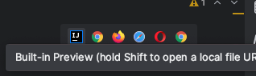
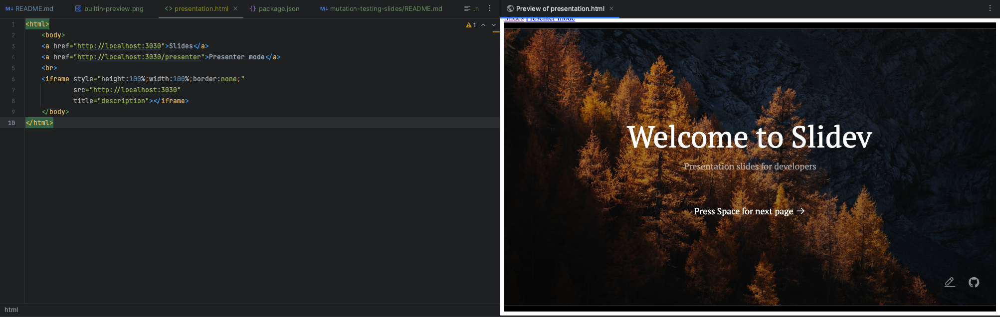

[//]: # (Use https://jqwik.net/)

# property-based-testing
Materials to present Property-Based testing principles

## Use cases

Go in See [Java sources](./property-based-testing-src)

```shell
cd ./property-based-testing-src
```

A https://taskfile.dev/ is provided to quickly generate:

[//]: (# TODO)

## Slides

Uses https://sli.dev/guide/install.html#starter-template.

### Run it

We use yarn to run the slides. Make sure your node version is >14.
See [Slides README](./property-based-testing-slides/README.md)

- Go inside [property-based-testing-slides](./property-based-testing-slides)
- Run `yarn slidev` or `yarn dev` (it will open the presentation in your browser)

### Share in IntelliJ

Thanks to [Presentation HTML file](./property-based-testing-slides/presentation.html), you can present your slides directly from IntelliJ

- Run Slidev as mentioned [here](#run-it)
- Open [presentation.html](./property-based-testing-slides/presentation.html) in IntelliJ
- Choose the built-in preview 

  

- And here is the result:

  
