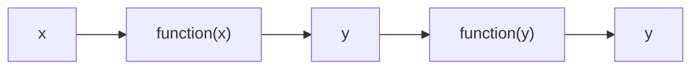
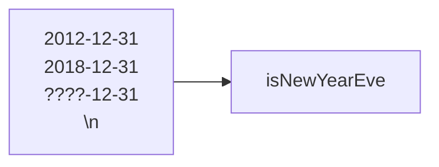
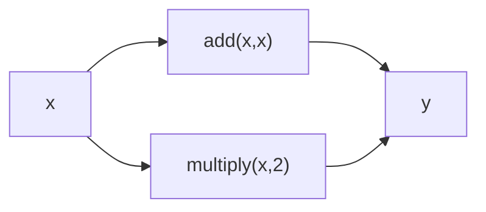
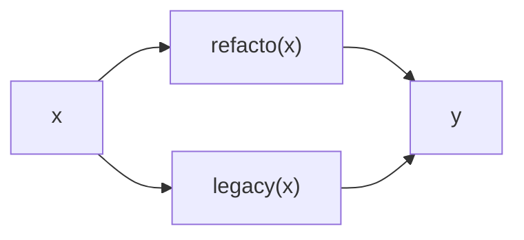
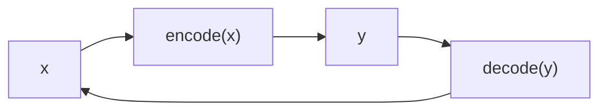

---
# try also 'default' to start simple
theme: seriph
colorSchema: dark
# apply any windi css classes to the current slide
class: 'text-center'
# https://sli.dev/custom/highlighters.html
highlighter: shiki
# show line numbers in code blocks
lineNumbers: false
fonts:
  sans: 'Robot'
  serif: 'Robot Slab'
# some information about the slides, markdown enabled
info: |
  ## Slidev Starter Template
  Presentation slides about Mutation Testing with PiTest

  Learn more at [Sli.dev](https://sli.dev)
# persist drawings in exports and build
drawings:
  persist: false
# page transition
transition: slide-left
# use UnoCSS
css: unocss
#background: ./assets/xmen.jpeg
---

# Introduction to Property-Based Testing

With JQwik

<div class="pt-12">
  <span @click="$slidev.nav.next" class="px-2 py-1 rounded cursor-pointer" hover="bg-white bg-opacity-10">
    Let's go <carbon:arrow-right class="inline"/>
  </span>
</div>

<div class="abs-br m-6 flex gap-2">
  <a href="https://github.com/ytvnr/property-based-testing" target="_blank" alt="GitHub"
    class="text-xl slidev-icon-btn opacity-50 !border-none !hover:text-white">
    <carbon-logo-github />
  </a>
</div>

<!--
The last comment block of each slide will be treated as slide notes. It will be visible and editable in Presenter Mode along with the slide. [Read more in the docs](https://sli.dev/guide/syntax.html#notes)
-->

---
transition: fade-out
---

# What is Property-Based Testing

PBT tries to combine the intuitiveness of Microtests with the effectiveness of randomized, generated test data.

Microtest is a small test that test small code.

Historically, PBT is "The thing that Quickcheck does". Quickcheck is a combinator library originally written in Haskell designed to generate test cases for tests suites. It has been adapted to other languages later.

In Quickcheck, we write assertions logical **properties** that function should fulfill. Then, Quickcheck tries to generate a test case that falsifies such assertions, one a case is found, quickcheck reduces to the minimal failing subset, enabling the developer to fix its function. 

<!--
A unit test tests a code unit (method, class, or small set of classes).
Micro-tests can be understood the same way by testing a very small portion of code.
A combinator library implements "combinators" for a functional language. It offers functions (a combinator) that combine functions together to make bigger functions.
-->

---
transition: fade-out
---

# Unit-test vs Property-Based-test

| **Unit tests** | **Property-based tests**  |
|----------------|---------------------------|
| Fixed input    | Random Input              |
| One execution  | Many executions           |
| Assert result  | Assert result or behavior |


# Which library will we use ?

For this talk, we will use [Jqwik](https://jqwik.net/) which is an alternative test engine for the JUnit 5 platform that focuses on PBT.

A lot of libraries can be found for PBT.
For Java, you can use the following:
- JUnit-Quickcheck (integrates with JUnit 4)
- QuickTheories
- Vavr (a functional library that comes with a PBT module)
- jetCheck
- ScalaCheck
- KotlinTest
- And a lot of others

---
transition: fade-out
---

# Creating a property

You just create a method with `public`, `protected` or package-scoped visbility, and you annotate it with `@Property`.
A property is supposed to have one or more parameters, each annotated with `@ForALl`. Those parameters will be filled by Jqwik at runtime.

A property method has to:
- either return a `boolean` that signifies success or failure for this property
- or return nothing (`void`). In that case, you have to use assertions to check property's invariant.

`@Property` has a lot of attributes that can be configured to customize your test:
- `int tries`: the number of times jqwik tries to generate parameter values for this method. Default is `1000`.
- `String seed`: the random seed to use for generating values. It allows to rerun a previously failing test with the exact same parameter values, which is useful to reproduce, debug and fix.
- `GenerationMode generation`: choose the principal approach to generate values:
  - `AUTO` uses the exhaustive generation, and tries to do all the possible combinations in the limit of `tries` attribute
  - `RANDOMIZED`
  - `EXHAUSTIVE` is like auto but maximum is not the number of tries but `Integer.MAX_VALUE`
  - `DATA_DRIVEN` allows to use a custom data provider
- More at: https://jqwik.net/docs/current/user-guide.html#optional-property-attributes

<!--
Works with any assertion library (JUnit, Hamcrest, AssertJ).
-->

---
transition: fade-out
---

# Testing properties

_A property is supposed to describe a generic invariant or post condition of your code, given some precondition_

Let's play with the [Fizz Buzz Kata](http://codingdojo.org/kata/FizzBuzz/).

Iterating over numbers from 1 to 100,
- If the number is divisible by 3, then return "Fizz"
- If the number is divisible by 5, then return "Buzz"
- If the number is divisible by both 3 and 5, then return "FizzBuzz"
- Else, return the number

---
transition: fade-out
---

# Simple implementation of Fizz Buzz Kata

```java {all|6-9|all}
List<String> fizzBuzz() {
    return IntStream.range(1, 101).mapToObj((int i) -> {
      boolean divBy3 = i % 3 == 0;
      boolean divBy5 = i % 5 == 0;

        return divBy3 && divBy5 ? "FizzBuzz"
             : divBy3 ? "Fizz"
             : divBy5 ? "Buzz"
             : String.valueOf(i);
    }).collect(Collectors.toList());
}
```
<br>
<br>
<br>
<br>
> This function generates a list of a 100 elements matching the requirements of the Fizz Buzz Kata.

---
transition: fade-out
---

# A property from Fizz Buzz Kata

A property that can be extracted and tested from this function is: "Every multiple of 3 element starts with 'Fizz'".

First, we will create a _Precondition_ through `@Provide` of Jqwik library: "Consider number between 1 and 100 that are divisble by 3"

```java {all}
@Provide
Arbitrary<Integer> divisibleBy3() {
    return Arbitraries.integers().between(1, 100).filter(i -> i % 3 == 0);
}
```

Then, use it in your `@Property` and define the _PostCondition_: "The string returned by `fizzBuzz()` starts with `Fizz`" 

```java {all}
@Property
boolean every_third_element_starts_with_Fizz(@ForAll("divisibleBy3") int i) {
    return fizzBuzz().get(i - 1).startsWith("Fizz");
}
```

---
transition: slide-up
---

# Other properties to test

Now, we also have to test a number divisible by 5 will end with "Buzz" and a number divisible by both 3 and 5 will be equal to "FizzBuzz"

```java {all}
@Property
    boolean every_fifth_element_starts_with_Buzz(@ForAll("divisibleBy5") int i) {
        return fizzBuzz().get(i - 1).endsWith("Buzz");
    }

    @Property
    boolean every_third_and_fifth_element_starts_with_Buzz(@ForAll("divisibleBy3And5") int i) {
        return fizzBuzz().get(i - 1).equals("FizzBuzz");
    }

@Provide
    Arbitrary<Integer> divisibleBy5() {
       return Arbitraries.integers().between(1, 100).filter(i -> i % 5 == 0);
       }

@Provide
    Arbitrary<Integer> divisibleBy3And5() {
       return Arbitraries.integers().between(1, 100).filter(i -> i % 5 == 0 && i % 3 == 0);
       }
```
---
transition: slide-up
---

# Some Property-Based Testing patterns
<!--
https://blog.ssanj.net/posts/2016-06-26-property-based-testing-patterns.html
-->

## Idempotence - The more things change, the more they stay the same



Example: cleaning user input will always return the same result.

<!--
We want to verify the behavior, we cannot assert that everything is always good.
-->


---
transition: slide-up
---

## Invariant - Some things never change

The new year's eve property contains two invariants: the month should be December and the day of the month the 31. 


<!--
@IntRange(min = -999999999, max = 999999999)

Assume.that(anyDate.getMonthValue() == 12 && anyDate.getDayOfMonth() == 31);
Assumptions.assumeThat(anyDate.getMonthValue() == 12 && anyDate.getDayOfMonth() == 31).isFalse();
-->

---
transition: slide-up
---

## Analogy

Adding x to x is the same as x multiplied by two.



> It does not verify that both of these function are correctly implemented. It does verify that they behave consistently in this case.

<div v-click class="text-xl p-2">

A real life use case would be the refactoring of a function:



</div>

<!--
@Property
    public void shouldHaveSameResultInRefactorAndLegacy(@ForAll @Size(min = 1) List<Analogy.@From("generateUsers") User> users) {
        System.out.println(users);
        final double legacy = Analogy.averageAgeLegacy(users);
        final double refactor = Analogy.averageAgeRefacto(users);
        Assertions.assertThat(legacy).isEqualTo(refactor);
    }

    
    @Provide
    Arbitrary<Analogy.User> generateUsers() {
        Arbitrary<String> names = Arbitraries.strings().withCharRange('a', 'z').ofMinLength(3).ofMaxLength(21);
        Arbitrary<Integer> ages = Arbitraries.integers().between(1, 130);

        return Builders.withBuilder(Analogy.User::new)
               .use(names).inSetter(Analogy.User::setName)
               .use(ages).inSetter(Analogy.User::setAge)
               .build();
    }
-->

---
transition: slide-up
---

## Symmetry - There and back again

Convert a value to another value and then convert it back to the original value.

Serialization or encoding are a good example of this pattern.

A reversible function ensure you don't lose any information.



---
transition: slide-up
---

# Exception reporting

```java
@Property
	boolean absoluteValueOfAllNumbersIsPositive(@ForAll int anInteger) {
       return Math.abs(anInteger) >= 0;
       }

@Property
	void lengthOfConcatenatedStringIsGreaterThanLengthOfEach(
@ForAll String string1, @ForAll String string2
       ) {
       String conc = string1 + string2;
       Assertions.assertThat(conc.length()).isGreaterThan(string1.length());
       Assertions.assertThat(conc.length()).isGreaterThan(string2.length());
       }
```


<!--
Absolute value:
Integer in java are 32-bit number which are signed: half of the range is lower than 0 and the rest is greater or equal to 0.
The failing value here is Integer.MIN_VALUE
The Javadoc of Math.abs(int) says: "Note that if the argument is equal to the value of Integer.MIN_VALUE, the most negative representable int value, the result is that same value"

Length of concatenated strings:
The property does not take care of empty strings.
-->

---
transition: slide-up
---

# Result Shrinking

If a property can be falsified by a set of value, Jqwik will try to "shrink" the sample in order to find a smaller sample that also falsify the property.

```java
@Property
boolean stringShouldBeShrunkToAA(@ForAll @AlphaChars String aString) {
    return aString.length() > 5 || aString.length() < 2;
}
```

```
AssertionFailedError: Property [stringShouldBeShrunkToAA] falsified with sample {0="aa"}

tries = 38 
checks = 38 
...
Shrunk Sample (5 steps)
-------------------------
  aString: "AA"

Original Sample
---------------
  aString: "RzZ"
```

`AA` is the shortest failing string and `A` the lowest numeric value of allowed characters. 

Shrinking can be disabled

---
transition: fade
---

# Lifecycle methods

- `@BeforeContainer` and `@AfterContainer`: equivalent to JUnit `@BeforeClass` and `@AfterClass`, run once before or after the container. An embedded container class can be annotated with `@Group`.
- `@BeforeProperty` and `@AfterProperty`: equivalent to JUnit `@BeforeEach` and `@AfterEach`, run once before each property or example.
- `@BeforeTry` and `@AfterTry`: runs before each try of a property. `@BeforeTry` can also be used on a class member to reset it before a try:

```java
class BeforeTryMemberExample {

	@BeforeTry
	int theAnswer = 42;

	@Property
	void theAnswerIsAlways42(@ForAll int addend) {
		Assertions.assertThat(theAnswer).isEqualTo(42);
		theAnswer += addend;
	}
}
```

---
transition: slide-up
---

# Summary

- Short tests with a lot of inputs
- Control over the injected data
- Based on JUnit: just a lib to import and tests can coexist
- Good complementarity with Unit tests to detects bugs from edge cases
- Low effort to write tests
- No dataset to maintain for testing, only providers to write once
- Based on JUnit: you can use the same tooling to generate coverage reports

## To go further

- [Jqwik User guide](https://jqwik.net/docs/current/user-guide.html)

---
layout: image
class: text-center align-middle
image: ./assets/victory.jpeg
---

[//]: # (I can do CSS, but it's so simple with <br> 😅)
<br>
<br>
<br>
<br>
<br>
<br>
<br>
<br>
<br>
<br>
<br>
<br>
<br>
<br>
<br>

[https://github.com/ytvnr/property-based-testing](https://github.com/ytvnr/property-based-testing)
